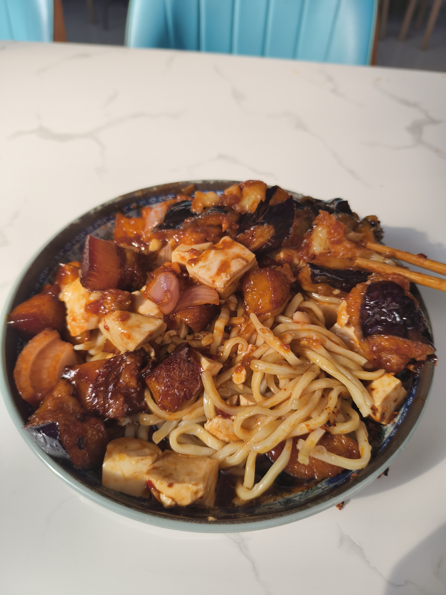
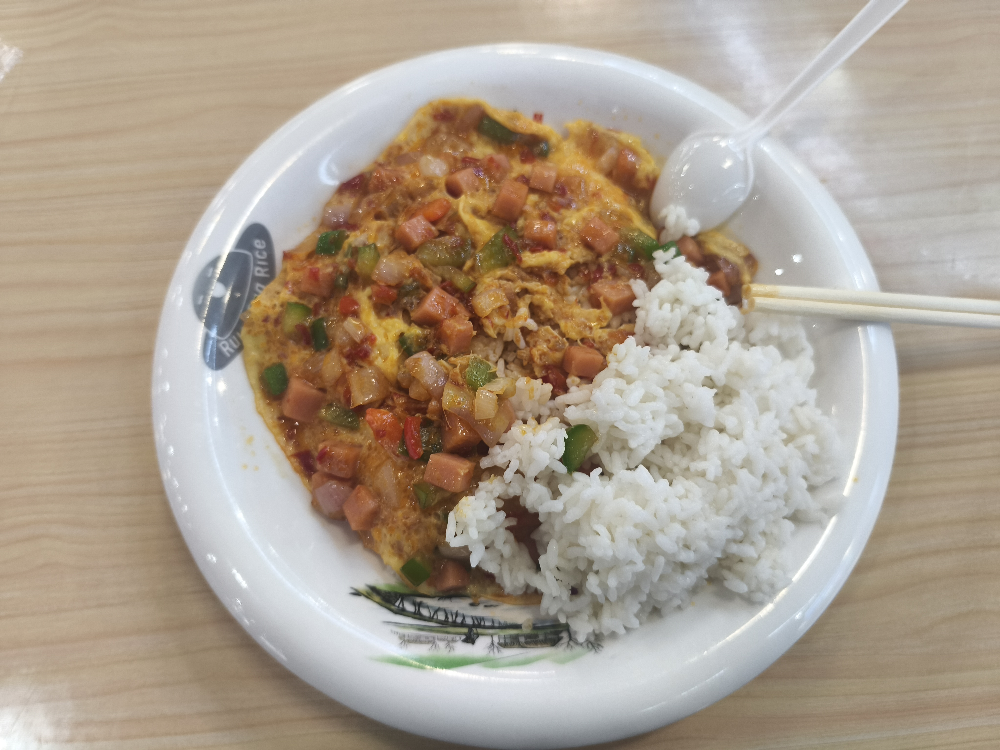

# 东岳厅★★★★★

#### 馋嘴鱼
位置：东岳厅！东北角落？？？
推荐指数：★★★★★
个人评价：重铸傲来荣光，我辈义不容辞（make aolai great again）
之所以把他放到第一位，是我觉得现在这个门面位置配不上他的实力
曾经在傲来厅进门第一位，傲来仙逝以后搬到东岳，说实话窗口位置有点不太好，限制了发挥
里面的所有品类都汤汁浓郁，蔬菜裹着浓郁的汤汁，肥牛搭配米饭，不多说了，懂得都懂，（曾经我不知道吃什么就吃这个）
加分项：里面大叔的服务态度尤其好
#### 东岳的自选菜（曾经在傲来南边）

位置：东岳的北边那一排
推荐指数：★★★★☆
个人评价：长期速食（bushi），量大管饱，经济实惠
曾经位于傲来厅的自选菜，在傲来厅逝世以后搬到了东岳厅。菜品繁多，经济实惠，有米饭和面两种选择，出餐迅速，美中不足的是某些菜有点咸（免责声明：鄙人以前在傲来感觉有一点咸，已经很久没吃了，改了当我没说）

！！！！！！！！！！！！！！！！！神临！！！！！！！！！！！！！！！！！！！！！！
名称：滑蛋饭
位置：东岳厅
推荐指数：★★★★★
个人评价：神临，王从天降愤怒狰狞，东岳厅最高的山
纯纯炸鱼的来了，双椒火腿你就吃吧，主播的最爱，可能有些夸张，但是在我这里他值这个分
