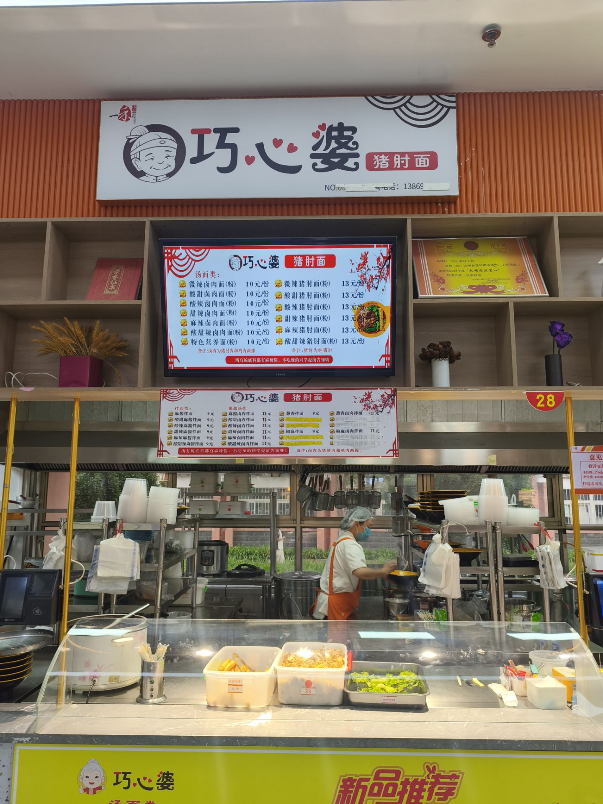
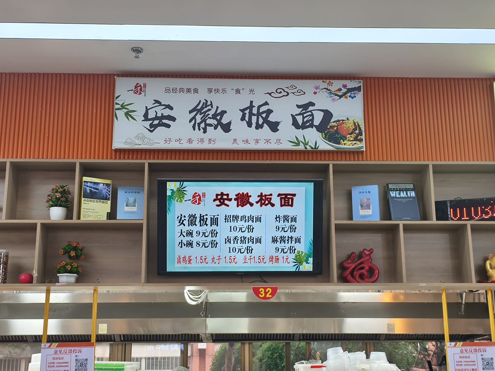
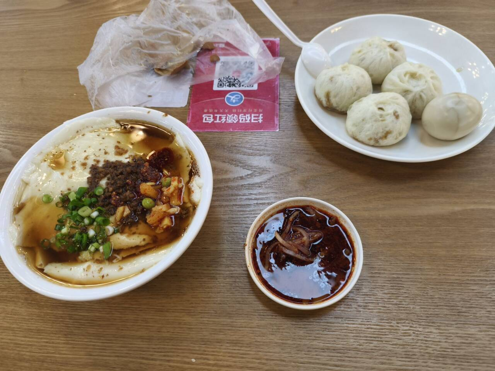
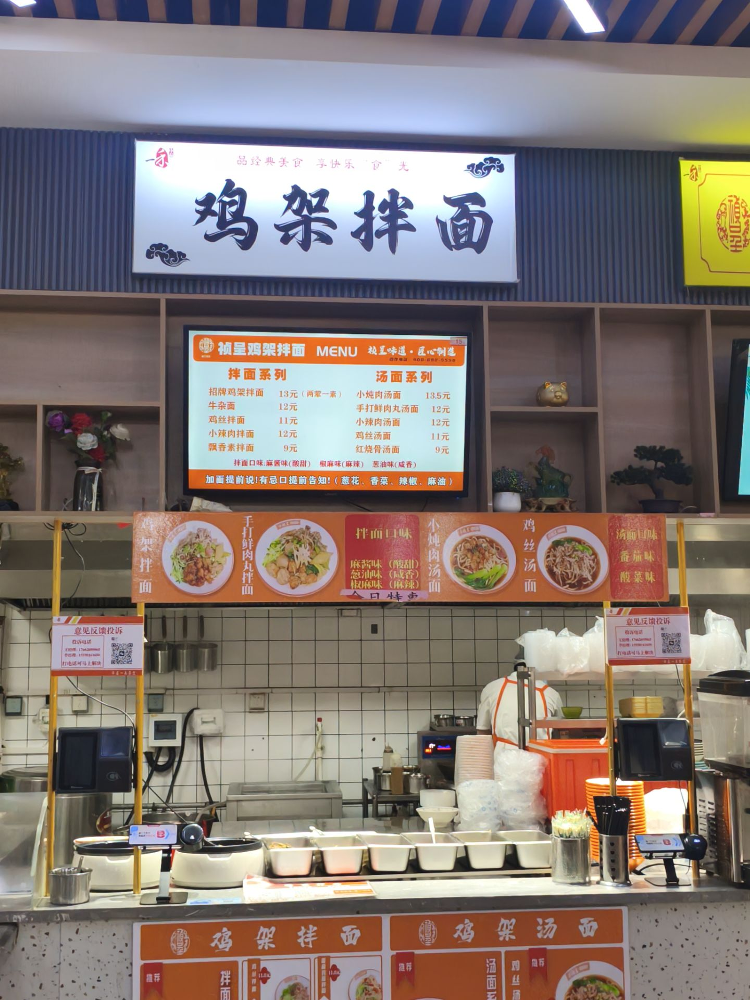

# 凤凰厅★★★★★

凤凰厅------史上最强的餐厅

#### 巧心婆（酸辣猪肘面）

位置：凤凰厅南侧东南角

推荐指数：★★★★★（主播最爱之一）

个人评价：汤面界最高的山

我只吃过酸辣猪肘面，但是吃了无数次。生菜搭配油条和肉丝（窗口给的肉很多），加上浓郁的酸辣汤汁，而且还会在底下放一些麻酱，建议吃的时候搅拌一下，让麻酱翻上来（我的拍照技术可能导致看起来并不好吃，但是真的非常美味），

#### 凤凰安徽板面

图中是卤香猪肉面，至于板面的图，相册里没找到

位置：凤凰厅

推荐指数：★★★★★

个人评价：学校最好吃的板面（虽然只有一家版面）

主播吃过板面和面。板面里面会加一点黄豆和肉，小吃有狮子头，火腿肠，卤蛋，豆腐干四种选择，豆腐干非常美味。面的话有点看运气了，有的时候面非常晶莹剔透，有时候感觉一般。综合评价给到顶级。
卤香猪肉面的肉给的很多，肉质软烂，入口即化，之前吃的时候不知道为什么有一股火锅味

#### 凤凰自选菜

位置：凤凰厅

推荐指数：★★★★★

个人评价：懂得都懂，我不信有人没吃过，菜品繁多，味道也还可以，但是说实话给的米饭一般

#### 早餐小笼包+豆腐脑

位置：凤凰厅的一个角落（靠近放餐具的地方)

推荐指数：★★★☆☆

个人评价：主播本来不打算评价早餐的，因为说实话我一般早晨起不来，但是大三有段时间昼夜颠倒，熬穿了就过去吃个早饭。卖小笼包的就只有龙山卖糁（sa）汤的，我感觉那个太一般了。而且

我作为纯种赛级临沂人，必须狠狠diss这个龙山糁汤，确实不正宗。

小笼包还不错，青椒还是什么椒的很不错。也有卖胡辣汤（我不是河南人不评价了），但感觉一般吧。
图片中的==豆腐脑==还挺好吃的，我忘记哪个窗口了，但就在这个附近。

#### 麻辣香锅

位置：凤凰厅的一个角落

推荐指数：★★★★★

个人评价：好吃，刘神的最爱，不过我个人并不是非常喜欢吃。我不信有人没吃过，至于吃过的可以尝试一下变态辣。

#### 鸡架拌面

位置：麻辣香锅旁边

推荐指数：★★★★★（我的最爱之一）

个人评价：主播一次没吃过鸡架拌面，但是主播吃了无数次鸡丝拌面，简直神了，这里推荐椒麻口味，当然小炖肉也很不错。配菜的话茄子很脆，旋风土豆也很不错，

#### 牛肉泡馍

推荐指数：★★★☆☆

个人评价：泡馍感觉都一般，有一款给粉和泡面+烧饼的那个很夯，牛肉能看出来确实是牛肉，没啥大毛病，眉毛
