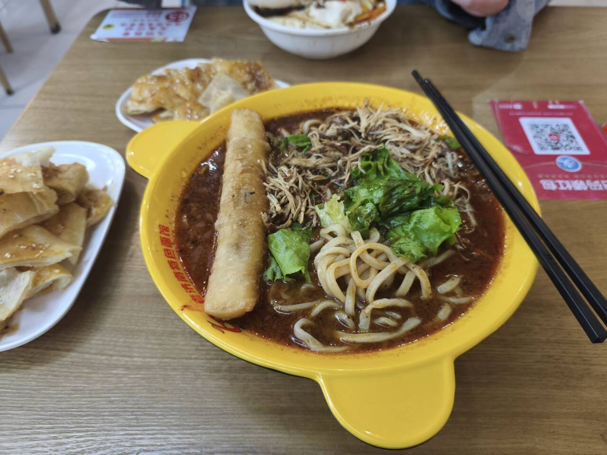
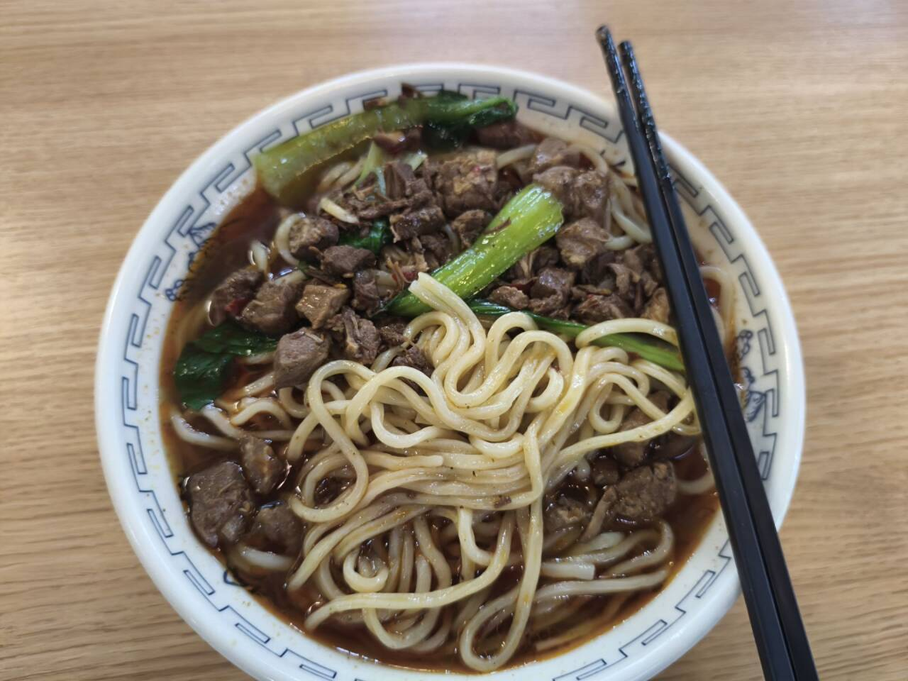
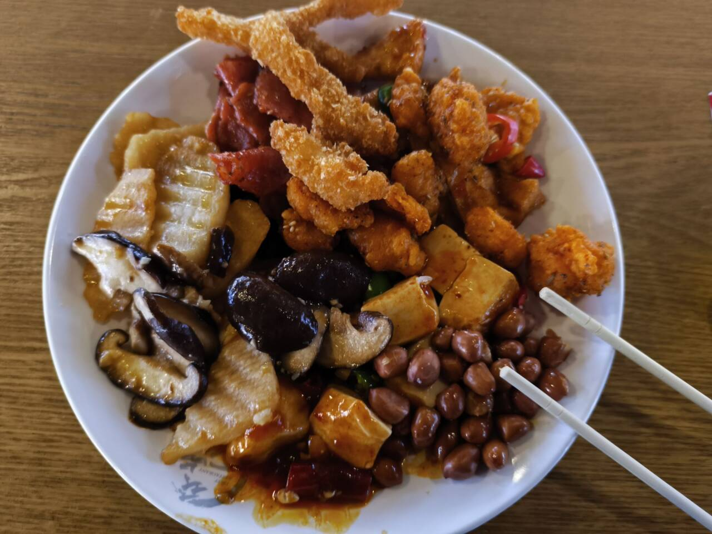

# 凤凰厅

## 酸辣猪肘面

位置：凤凰厅南侧东南角  
推荐指数：★★★★★（主播最爱之一）

个人评价：汤面界最高的山。

我只吃过酸辣猪肘面，但是吃了无数次。生菜搭配油条和肉丝（窗口给的肉很多），加上浓郁的酸辣汤汁，让人欲罢不能。我的拍照技术可能导致看起来并不好吃，但是真的非常美味。

## 凤凰板面

位置：凤凰厅  
推荐指数：★★★★★

个人评价：学校最好吃的板面，虽然只有一家板面。

主播吃过板面和面。板面里面会加一点黄豆和肉，小吃有狮子头、火腿肠、卤蛋、豆腐干四种选择，豆腐干非常美味。面的话有点看运气了，有的时候面非常晶莹剔透，有时候感觉一般。综合评价给到顶级。

## 凤凰自选菜

位置：凤凰厅  
推荐指数：★★★★★

个人评价：懂得都懂，我不信有人没吃过。菜品繁多，味道也还可以，但是说实话给的米饭一般。

## 早餐小笼包 + 豆腐脑

位置：凤凰厅的一个角落，靠近放餐具的地方  
推荐指数：★★★☆☆

个人评价：主播本来不打算评价早餐的，因为说实话我一般早晨起不来，但是大三有段时间昼夜颠倒，熬穿了就过去吃个早饭。

卖小笼包的就只有龙山卖糁汤的，我感觉那个太一般了。而且我作为纯种赛级临沂人，必须狠狠 diss 这个龙山糁汤，确实不正宗。

小笼包还不错，青椒还是什么椒的很不错。也有卖胡辣汤，我不是河南人不评价了，但感觉一般吧。图片中的豆腐脑还挺好吃的，我忘记哪个窗口了，但就在这个附近。

## 麻辣香锅

位置：凤凰厅的一个角落  
推荐指数：★★★★★

个人评价：好吃，刘神的最爱，不过我个人并不是非常喜欢吃。

## 鸡架拌面

位置：麻辣香锅旁边  
推荐指数：★★★★★（我的最爱之一）

个人评价：主播一次没吃过鸡架拌面，但是主播吃了无数次鸡丝拌面，简直神了。这里推荐椒麻口味，当然小炖肉也很不错。配菜的话茄子很脆，旋风土豆也很不错。
