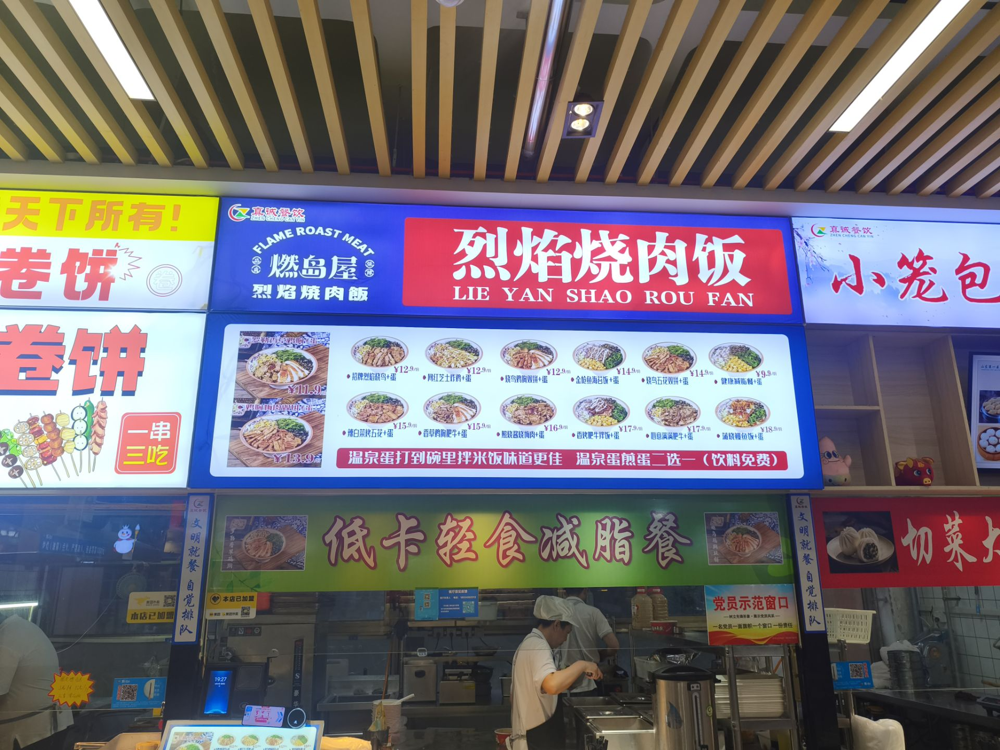
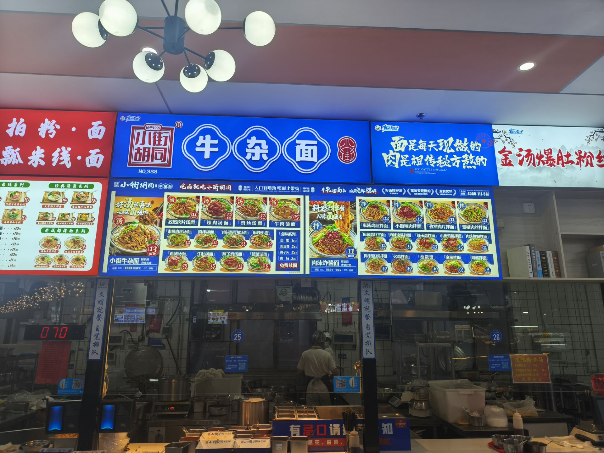
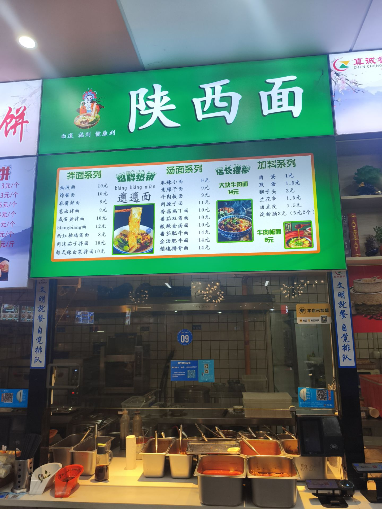
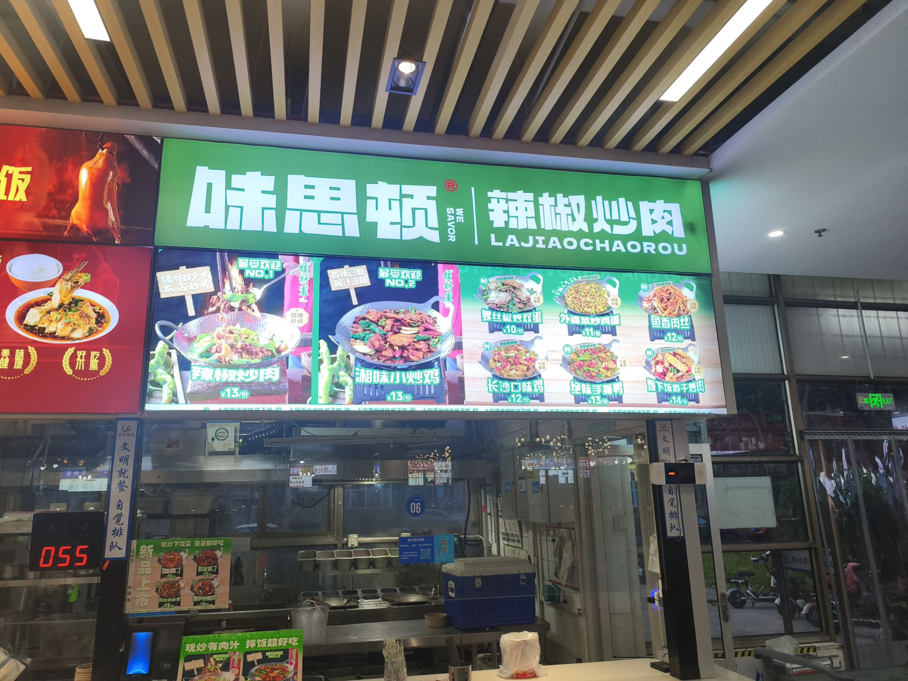
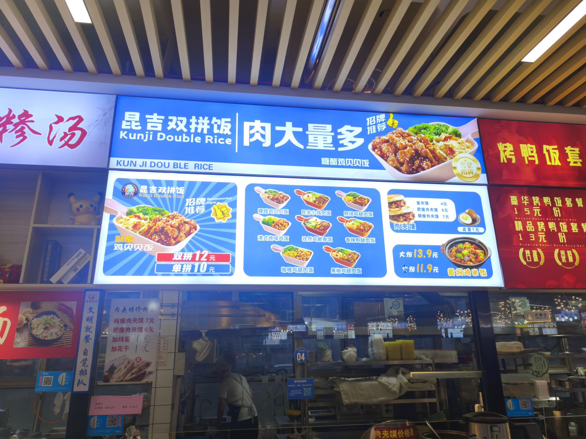
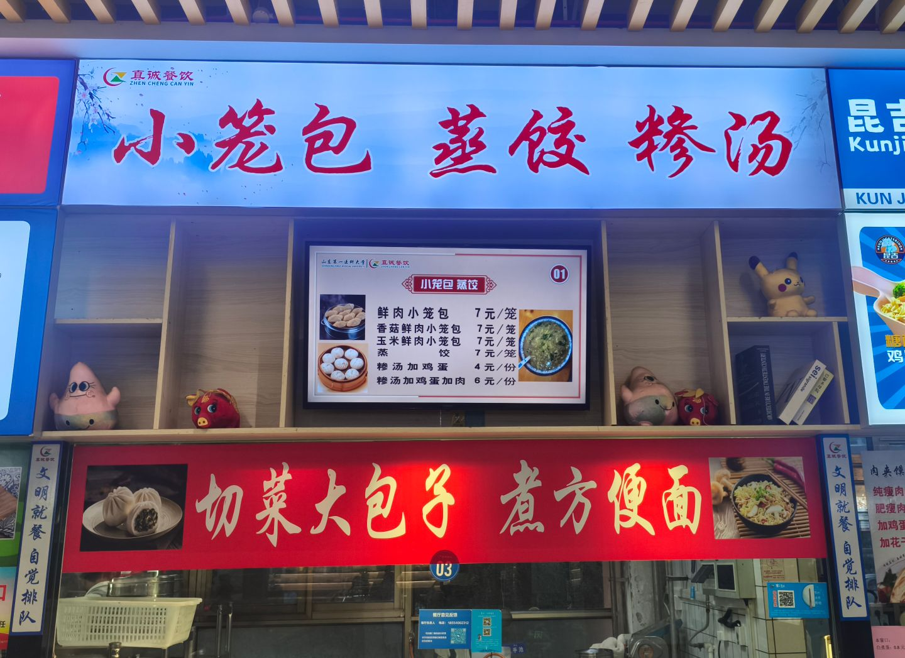

# 龙山厅★★★

龙山偏快餐来着，我不是很喜欢，所以随便点评吧
#### 天下好面

推荐指数：★★★★☆（还未搞到）
个人评价：主播吃过天下好面的四款面条，印象最深的就是骨汤面，确实好吃美的喷，但是其他吃过的三款面感觉都不喜欢，独木难支，这里给到四星吧。
#### 烈焰烧肉饭

推荐指数：★★★★☆
个人评价：作为一款快餐非常的不错，我非常喜欢吃芝士炸鸡，辣白菜五花和肥牛也非常不错，至于海鲜类的我不食海鲜，所以不评价了
#### 牛杂面

推荐指数：★★★☆☆～★★★★☆
个人评价：我只吃过麻辣小面，第一次吃的时候惊为天人，太好吃了，滚烫的热油泼洒在香葱和蒜末上，激发出一阵香味，加上骨汤的鲜美，可惜确实分量有点少
但是后面吃的几次感觉吃不出当时的味道了，不知道为什么，之前吃的时候送我一个卤蛋，所以给一个四星吧
#### 正宗山东杂粮煎饼

推荐指数：★★★☆☆
个人评价：快餐没啥好说的，给到npc吧

#### 陕西面

推荐指数：★★★☆☆
个人评价：我吃过biangbiang面和，炸酱面，肉沫茄子拌面，韩式辣白菜拌面。唯一我觉得很美味的就是肉沫茄子拌面，但是油确实有点太大了，其他给到npc吧
#### 味思顿 辣椒炒肉
推荐指数：★★★★☆
个人评价：还不错，分量很足，刘神予以很高的评价，但是我认为辣椒不够辣，当然这是中和了大部分同学不能吃太辣的原因，但是如果辣椒炒肉不够辣的话，那么直接叫不辣的辣椒炒肉得了
#### 双拼饭+肉夹馍

推荐指数：★★★★☆
个人评价：这个我是吃了非常多次，肉夹馍的分量非常足，如果单论肉夹馍的话可以给到5颗★。至于双拼饭，我强烈推荐香辣的那份。缺点就是这个双拼饭的容器太逆天了，建议打包带走，总之就是快餐的典型吧
#### 小笼包

推荐指数★★★☆☆
个人评价：小笼包不评价了，只有香菇还可以，懂我意思。糁（sa）汤的话，不正宗。切肉大包子之前吃过青椒火腿的还不错，不知道还有没有，其他不推荐。

