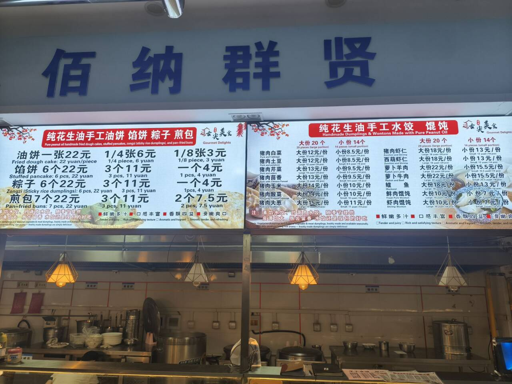
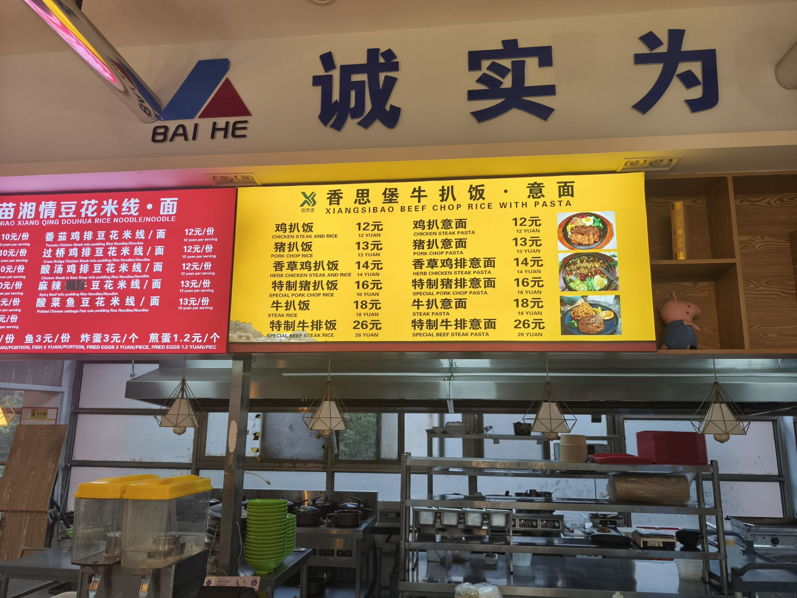
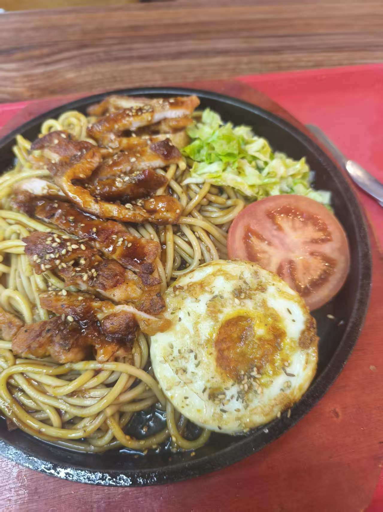
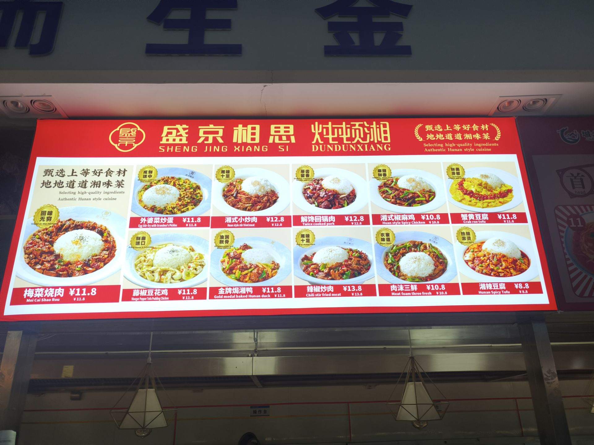
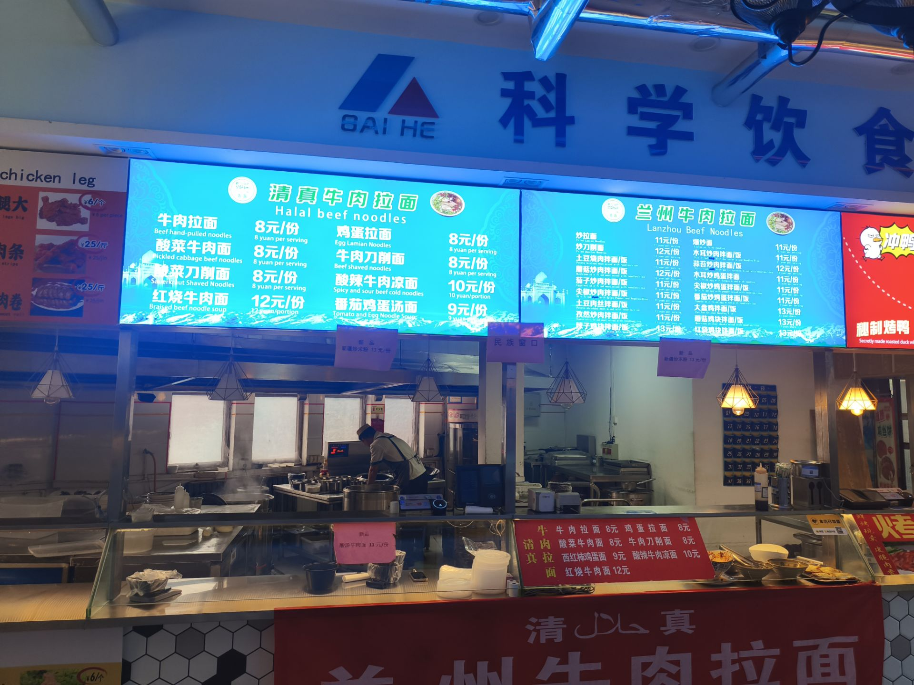

# 天烛厅★★★★

吐槽一句，天烛式微，感觉好吃的越来越少了，以前很美味的窗口都走了，太遗憾了
#### 手工水饺 

位置：天烛厅的东北角
推荐指数：★★★★★
个人评价：冬至必吃榜，手工水饺最高的山，老师们的最爱（这里站不下这么多人)
鄙人在学校里最喜欢吃的水饺，品类繁多，能看得出来并非速冻水饺，
搭配窗口提供的美味蒜沫、醋和辣椒，简直神了，综合评价给到顶级

#### 牛扒or鸡扒 意面/米

推荐指数：(★★★★☆  +  ★★★★★)/2   (4.5星)
位置：天烛厅靠近洗手池的地方
个人评价：纯纯小众哥来的    漂亮饭（bushi）
说实话，食物本身能够达到5颗星，但是出餐太慢了。如果是资深老饕，可以自动升级到★★★★★，但是大部分同学可能会考虑到兵贵神速，所以这里给到一个四星半。

#### 炖顿湘

位置：天烛厅
推荐指数： ★★★★☆
个人评价：量大管饱，美味
主播这个窗口记得很清楚：米饭给的特别多
推荐：
梅菜烧肉：非常香醇，肉质软烂，可惜有点太咸了，但是米饭中和了这一点
湘辣豆腐：美味，里面加带一些肉末，很好吃
辣椒炒肉：量大管饱，肉非常多，挺好吃的
肉沫三鲜：非常好吃，里面有茄子 土豆条 肉沫
剩下忘记了，待写

清真牛肉拉面

位置：天烛厅进门
推荐指数： ★★★★☆
个人评价：我只吃过牛肉拉面 酸菜牛肉面和炒拉面，感觉还不错，没有保存的食物图片，只有拍得窗口图片