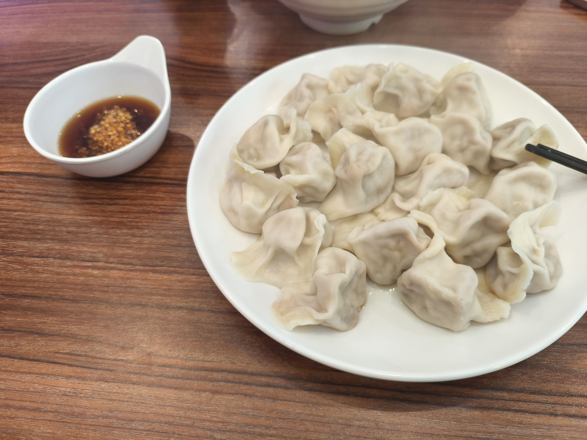

# 天烛厅

## 手工水饺

位置：天烛厅的东北角  
推荐指数：★★★★★

个人评价：冬至必吃榜，手工水饺最高的山，老师们的最爱，这里站不下这么多人。

鄙人在学校里最喜欢吃的水饺，品类繁多，能看得出来并非速冻水饺。搭配窗口提供的美味蒜沫、醋和辣椒，简直神了，综合评价给到顶级。

## 牛扒 or 鸡扒 意面 / 米

位置：天烛厅靠近洗手池的地方  
推荐指数：(★★★★☆ + ★★★★★) / 2，也就是 4.5 星

个人评价：纯纯小众哥来的，漂亮饭。

说实话，食物本身能够达到 5 颗星，但是出餐太慢了。如果是资深老饕，可以自动升级到 ★★★★★，但是大部分同学可能会考虑兵贵神速，所以这里给到一个四星半。

## 顿顿香

位置：天烛厅  
推荐指数：★★★★★

个人评价：量大管饱，美味。

主播这个窗口记得很清楚：米饭给的特别多。

推荐：

- 梅菜烧肉：非常香醇，肉质软烂，可惜有点太咸了，但是米饭中和了这一点。
- 豆腐：美味，里面加带一些肉末，很好吃。
- 辣椒炒肉：量大管饱，肉非常多，挺好吃的。
- 剩下忘记了，待写。
